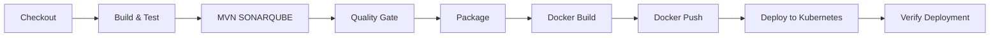

# Atelier 3 - Déploiement Kubernetes de l'Application Student Management

## 📋 Architecture déployée

### Vue d'ensemble
Cette application Spring Boot est déployée sur Kubernetes avec une base de données MySQL persistante. L'architecture suit les meilleures pratiques de conteneurisation et d'orchestration.

### Composants de l'architecture

```
┌─────────────────────────────────────────────────────────────────┐
│                      Cluster Kubernetes                          │
│                                                                   │
│  ┌──────────────────────┐         ┌──────────────────────┐     │
│  │   Student Management  │         │       MySQL          │     │
│  │    (2 replicas)       │────────▶│    (1 replica)       │     │
│  │                       │         │                       │     │
│  │  Port: 8089          │         │  Port: 3306          │     │
│  └──────────────────────┘         └──────────────────────┘     │
│           │                                  │                   │
│           │                                  │                   │
│  ┌────────▼────────────┐          ┌─────────▼──────────┐       │
│  │  student-management │          │   mysql-service    │       │
│  │      -service       │          │   (ClusterIP)      │       │
│  │    (NodePort)       │          └────────────────────┘       │
│  │   NodePort: 30089   │                    │                   │
│  └─────────────────────┘          ┌─────────▼──────────┐       │
│           │                        │      mysql-pvc     │       │
│           │                        │   (Storage: 1Gi)   │       │
│           │                        └────────────────────┘       │
│           │                                  │                   │
└───────────┼──────────────────────────────────┼───────────────────┘
            │                                  │
            ▼                                  ▼
    Accès externe                      Stockage persistant
  http://<IP>:30089/student             /mnt/data/mysql
```

## 🔧 Ressources Kubernetes déployées

### 1. MySQL Database

#### ConfigMap (`mysql-configmap.yaml`)
- **Rôle**: Stocke les variables de configuration non sensibles pour MySQL
- **Données**: Nom de la base de données (`student_management`)

#### Secret (`mysql-secret.yaml`)
- **Rôle**: Stocke les informations sensibles (mots de passe) encodés en base64
- **Données**: 
  - Root password
  - Nom d'utilisateur application (`studentapp`)
  - Mot de passe application (`studentpass`)

#### PersistentVolume (`mysql-pv.yaml`)
- **Rôle**: Définit un volume de stockage physique sur le cluster
- **Capacité**: 1Gi
- **Type**: hostPath (stockage local sur le nœud)
- **Chemin**: `/mnt/data/mysql`

#### PersistentVolumeClaim (`mysql-pvc.yaml`)
- **Rôle**: Réclame/demande un volume de stockage pour MySQL
- **Capacité demandée**: 1Gi
- **Mode d'accès**: ReadWriteOnce

#### Deployment (`mysql-deployment.yaml`)
- **Rôle**: Déploie et gère les pods MySQL
- **Replicas**: 1 (base de données stateful)
- **Image**: mysql:8.0
- **Port**: 3306
- **Volume monté**: Utilise le PVC pour la persistance des données
- **Ressources**: 
  - Limites: 512Mi RAM, 500m CPU
  - Requêtes: 256Mi RAM, 250m CPU

#### Service (`mysql-service.yaml`)
- **Rôle**: Expose MySQL en interne au cluster
- **Type**: ClusterIP (accès interne uniquement)
- **Port**: 3306

### 2. Application Spring Boot

#### ConfigMap (`app-configmap.yaml`)
- **Rôle**: Configuration de l'application
- **Données**:
  - URL de connexion MySQL
  - Nom d'utilisateur
  - Configuration JPA/Hibernate
  - Port de management

#### Secret (`app-secret.yaml`)
- **Rôle**: Mot de passe de la base de données
- **Données**: Mot de passe encodé en base64

#### Deployment (`app-deployment.yaml`)
- **Rôle**: Déploie et gère les pods de l'application
- **Replicas**: 2 (haute disponibilité)
- **Image**: fekikarim/student-management:latest
- **Port**: 8089
- **InitContainer**: Attend que MySQL soit disponible avant de démarrer
- **Probes**:
  - **Liveness**: Vérifie que l'app est vivante (health check)
  - **Readiness**: Vérifie que l'app est prête à recevoir du trafic
- **Ressources**:
  - Limites: 512Mi RAM, 500m CPU
  - Requêtes: 256Mi RAM, 250m CPU

#### Service (`app-service.yaml`)
- **Rôle**: Expose l'application à l'extérieur du cluster
- **Type**: NodePort (accès externe)
- **Port interne**: 8089
- **NodePort**: 30089 (port accessible depuis l'extérieur)

## 🚀 Pipeline CI/CD

### Étapes du pipeline Jenkins



#### 1. **Checkout**
- Clone le code depuis GitHub (branche main)
- Rend le script Maven exécutable

#### 2. **Build & Test**
- Compile le code source
- Exécute les tests unitaires avec Maven

#### 3. **MVN SONARQUBE**
- Analyse de la qualité du code avec SonarQube
- Détection des bugs, vulnérabilités et code smells

#### 4. **Quality Gate**
- Attend la validation du Quality Gate SonarQube
- Arrête le pipeline si le code ne respecte pas les critères de qualité

#### 5. **Package**
- Crée le fichier JAR de l'application

#### 6. **Docker Build**
- Construit l'image Docker de l'application
- Tags: `BUILD_NUMBER` et `latest`

#### 7. **Docker Push**
- Pousse l'image sur Docker Hub
- Connexion sécurisée avec credentials Jenkins

#### 8. **Deploy to Kubernetes**
- Applique les manifestes MySQL (ConfigMap, Secret, PV, PVC, Deployment, Service)
- Attend que MySQL soit prêt
- Applique les manifestes de l'application
- Met à jour l'image du deployment avec la nouvelle version
- Attend que l'application soit prête

#### 9. **Verify Deployment**
- Vérifie l'état des déploiements
- Affiche les pods et services

## 📦 Instructions de déploiement

### Prérequis
- Kubernetes cluster (Minikube ou autre)
- kubectl configuré
- Docker Hub account (pour le push des images)

### Déploiement manuel

#### Option 1: Avec le script de déploiement

```bash
# Rendre le script exécutable
chmod +x deploy-k8s.sh

# Déployer l'application
./deploy-k8s.sh apply

# Vérifier le status
./deploy-k8s.sh status

# Voir les logs
./deploy-k8s.sh logs

# Supprimer le déploiement
./deploy-k8s.sh delete
```

#### Option 2: Manuellement avec kubectl

```bash
# 1. Déployer MySQL
kubectl apply -f k8s/mysql-configmap.yaml
kubectl apply -f k8s/mysql-secret.yaml
kubectl apply -f k8s/mysql-pv.yaml
kubectl apply -f k8s/mysql-pvc.yaml
kubectl apply -f k8s/mysql-deployment.yaml
kubectl apply -f k8s/mysql-service.yaml

# 2. Attendre que MySQL soit prêt
kubectl wait --for=condition=ready pod -l app=mysql --timeout=120s

# 3. Déployer l'application
kubectl apply -f k8s/app-configmap.yaml
kubectl apply -f k8s/app-secret.yaml
kubectl apply -f k8s/app-deployment.yaml
kubectl apply -f k8s/app-service.yaml

# 4. Attendre que l'application soit prête
kubectl wait --for=condition=ready pod -l app=student-management --timeout=180s
```

### Déploiement automatique via Jenkins

1. **Configurer les credentials dans Jenkins**:
   - Docker Hub credentials (ID: `dockerhub-credentials`)
   - Kubeconfig pour accéder au cluster Kubernetes

2. **Déclencher le pipeline**:
   - Push sur la branche `main` du repository GitHub
   - Ou manuellement depuis l'interface Jenkins

### Accès à l'application

#### Sur Minikube (Vagrant):

```bash
# Obtenir l'IP de Minikube
minikube ip

# Accéder à l'application
curl http://$(minikube ip):30089/student/actuator/health
```

**URL**: `http://<MINIKUBE_IP>:30089/student`

#### Sur un cluster Kubernetes standard:

```bash
# Obtenir l'IP du nœud
kubectl get nodes -o wide

# Accéder à l'application
curl http://<NODE_IP>:30089/student/actuator/health
```

## 🔍 Commandes de vérification

### Vérifier les pods
```bash
kubectl get pods
kubectl describe pod <pod-name>
kubectl logs <pod-name>
```

### Vérifier les services
```bash
kubectl get svc
kubectl describe svc student-management-service
```

### Vérifier les déploiements
```bash
kubectl get deployments
kubectl rollout status deployment/student-management
```

### Vérifier le stockage
```bash
kubectl get pv
kubectl get pvc
```

### Vérifier les ConfigMaps et Secrets
```bash
kubectl get configmaps
kubectl get secrets
kubectl describe configmap app-config
```

### Tester l'application
```bash
# Health check
curl http://$(minikube ip):30089/student/actuator/health

# Prometheus metrics
curl http://$(minikube ip):30089/student/actuator/prometheus

# Test API (exemple)
curl http://$(minikube ip):30089/student/api/students
```

## 🐛 Dépannage

### Pod MySQL ne démarre pas
```bash
# Vérifier les logs
kubectl logs -l app=mysql

# Vérifier le PVC
kubectl get pvc mysql-pvc
kubectl describe pvc mysql-pvc

# Créer manuellement le répertoire sur le nœud si nécessaire
minikube ssh
sudo mkdir -p /mnt/data/mysql
sudo chmod 777 /mnt/data/mysql
```

### Application ne se connecte pas à MySQL
```bash
# Vérifier que MySQL est accessible
kubectl exec -it <app-pod-name> -- nc -zv mysql-service 3306

# Vérifier les variables d'environnement
kubectl exec -it <app-pod-name> -- env | grep SPRING

# Vérifier les logs de l'application
kubectl logs -l app=student-management
```

### Image Docker non accessible
```bash
# Vérifier que l'image existe sur Docker Hub
docker pull fekikarim/student-management:latest

# Forcer un nouveau pull
kubectl rollout restart deployment/student-management
```

## 📊 Monitoring et métriques

L'application expose des métriques Prometheus sur:
- Endpoint: `/student/actuator/prometheus`
- Port: 8089

## 🔐 Sécurité

- Les mots de passe sont stockés dans des Secrets Kubernetes (encodés en base64)
- Les services MySQL ne sont pas exposés à l'extérieur (ClusterIP)
- L'application utilise des probes pour garantir la disponibilité
- Les ressources sont limitées pour éviter la surconsommation

## 📝 Notes importantes

1. **Environnement Vagrant/Minikube**: Les PersistentVolumes utilisent `hostPath`, ce qui convient pour le développement mais pas pour la production
2. **Production**: Utiliser un StorageClass dynamique (AWS EBS, GCE PD, etc.)
3. **Secrets**: En production, utiliser un gestionnaire de secrets externe (HashiCorp Vault, AWS Secrets Manager, etc.)
4. **Base de données**: Pour la production, considérer un service managé (AWS RDS, Google Cloud SQL, etc.)

## 🎓 Concepts Kubernetes appliqués

- **Deployment**: Gestion déclarative des pods avec rolling updates
- **Service**: Load balancing et découverte de services
- **ConfigMap**: Séparation de la configuration et du code
- **Secret**: Gestion sécurisée des données sensibles
- **PersistentVolume/PVC**: Stockage persistant pour les données
- **Init Containers**: Gestion des dépendances au démarrage
- **Probes**: Health checks et readiness
- **Resource Limits**: Gestion des ressources CPU/RAM
