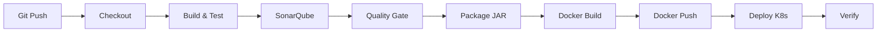

# Student Management - Kubernetes Deployment 🚀

Application Spring Boot de gestion d'étudiants déployée sur Kubernetes avec pipeline CI/CD complet.

[]()
[]()
[](https://hub.docker.com/r/fekikarim/student-management)

---

## 📋 Table des matières

- [Vue d'ensemble](#-vue-densemble)
- [Architecture](#-architecture)
- [Démarrage rapide](#-démarrage-rapide)
- [Documentation](#-documentation)
- [Ressources Kubernetes](#-ressources-kubernetes)
- [Pipeline CI/CD](#-pipeline-cicd)
- [Technologies](#-technologies)

---

## 🎯 Vue d'ensemble

Ce projet démontre le déploiement d'une application Spring Boot avec MySQL sur Kubernetes, incluant:

✅ **10 manifestes Kubernetes** (Deployment, Service, ConfigMap, Secret, PV, PVC)  
✅ **Pipeline CI/CD Jenkins** complet avec déploiement automatique  
✅ **Haute disponibilité** (2 replicas de l'application)  
✅ **Persistance des données** MySQL  
✅ **Health checks** et monitoring (Prometheus)  
✅ **Documentation complète** pour le rendu académique  

---

## 🏗️ Architecture

```
┌──────────────────────────────────────────────────┐
│           Kubernetes Cluster (Minikube)          │
│                                                   │
│  ┌────────────────┐      ┌─────────────────┐    │
│  │  Spring Boot   │──────│     MySQL       │    │
│  │  (2 replicas)  │      │  (Persistent)   │    │
│  │  Port: 8089    │      │  Port: 3306     │    │
│  └───────┬────────┘      └────────┬────────┘    │
│          │                        │              │
│   [NodePort: 30089]      [PersistentVolume]     │
│                                                   │
└──────────────────────────────────────────────────┘
           │
           ▼
    http://<IP>:30089/student
```

**Ressources déployées**: 10 manifestes Kubernetes
- 2 ConfigMaps (MySQL + App)
- 2 Secrets (MySQL + App)
- 1 PersistentVolume + 1 PVC
- 2 Deployments (MySQL + App)
- 2 Services (ClusterIP + NodePort)

---

## 🚀 Démarrage rapide

### Prérequis
- Kubernetes cluster (Minikube recommandé)
- kubectl configuré
- Vagrant (optionnel, pour environnement isolé)

### Installation en 5 commandes

```bash
# 1. Cloner le projet
git clone https://github.com/fekikarim/student-management.git
cd student-management

# 2. Préparer Minikube
minikube start
minikube ssh "sudo mkdir -p /mnt/data/mysql && sudo chmod 777 /mnt/data/mysql"

# 3. Déployer sur Kubernetes
chmod +x deploy-k8s.sh
./deploy-k8s.sh apply

# 4. Vérifier le déploiement
kubectl get pods
kubectl get svc

# 5. Tester l'application
curl http://$(minikube ip):30089/student/actuator/health
```

✅ **Terminé!** Votre application est déployée!

---

## 📚 Documentation

| Document | Description | Cas d'usage |
|----------|-------------|-------------|
| **[INDEX.md](INDEX.md)** | 🗺️ Navigation et vue d'ensemble | Commencez ici! |
| **[RAPPORT-RENDU.md](RAPPORT-RENDU.md)** | 📊 Rapport complet pour le rendu | Pour votre soumission académique |
| **[VAGRANT-GUIDE.md](VAGRANT-GUIDE.md)** | 🚀 Guide Vagrant pas-à-pas | Si vous utilisez Vagrant |
| **[COMMANDES-QUICK-START.md](COMMANDES-QUICK-START.md)** | ⚡ Commandes prêtes à copier | Déploiement rapide |
| **[K8S-DEPLOYMENT-README.md](K8S-DEPLOYMENT-README.md)** | 📚 Documentation technique | Référence complète |
| **[VAGRANT-SYNC-GUIDE.md](VAGRANT-SYNC-GUIDE.md)** | 🔄 Synchronisation des fichiers | Problèmes de sync |

**👉 Commencez par [INDEX.md](INDEX.md) pour être guidé!**

---

## 📦 Ressources Kubernetes

### MySQL (Base de données)
```
k8s/
├── mysql-configmap.yaml       # Configuration (nom de la DB)
├── mysql-secret.yaml          # Secrets (passwords)
├── mysql-pv.yaml              # Volume physique (1Gi)
├── mysql-pvc.yaml             # Demande de volume
├── mysql-deployment.yaml      # Déploiement (1 replica)
└── mysql-service.yaml         # Service ClusterIP
```

### Application Spring Boot
```
k8s/
├── app-configmap.yaml         # Configuration (DB URL, JPA...)
├── app-secret.yaml            # Secret (DB password)
├── app-deployment.yaml        # Déploiement (2 replicas)
└── app-service.yaml           # Service NodePort (30089)
```

---

## 🔄 Pipeline CI/CD



### Étapes du pipeline Jenkins

1. **Checkout** - Clone le code depuis GitHub
2. **Build & Test** - Compilation et tests Maven
3. **SonarQube** - Analyse de qualité du code
4. **Quality Gate** - Validation des critères qualité
5. **Package** - Création du JAR
6. **Docker Build** - Construction de l'image
7. **Docker Push** - Push vers Docker Hub
8. **Deploy to Kubernetes** ⭐ - Déploiement automatique
9. **Verify Deployment** ⭐ - Vérification du déploiement

---

## 🛠️ Technologies

### Backend
- **Spring Boot** 3.x - Framework Java
- **MySQL** 8.0 - Base de données
- **Spring Data JPA** - ORM
- **Maven** - Build tool

### DevOps
- **Docker** - Conteneurisation
- **Kubernetes** - Orchestration
- **Minikube** - Cluster K8s local
- **Jenkins** - CI/CD
- **SonarQube** - Qualité du code

### Monitoring
- **Spring Boot Actuator** - Health checks
- **Prometheus** - Métriques

---

## 📊 Commandes utiles

### Déploiement
```bash
./deploy-k8s.sh apply          # Déployer
./deploy-k8s.sh status         # Status
./deploy-k8s.sh logs           # Logs
./deploy-k8s.sh delete         # Supprimer
```

### Vérification
```bash
kubectl get all                # Vue d'ensemble
kubectl get pods              # Pods
kubectl get svc               # Services
kubectl logs -l app=student-management  # Logs app
```

### Tests
```bash
# Health check
curl http://$(minikube ip):30089/student/actuator/health

# Métriques Prometheus
curl http://$(minikube ip):30089/student/actuator/prometheus

# Info application
curl http://$(minikube ip):30089/student/actuator/info
```

---

## 🎯 Pour le rendu académique

### Fichiers à soumettre
✅ Code source complet (`src/`)  
✅ Manifestes Kubernetes (`k8s/`)  
✅ Pipeline Jenkins (`Jenkinsfile`)  
✅ Scripts de déploiement (`deploy-k8s.sh`)  
✅ Documentation ([RAPPORT-RENDU.md](RAPPORT-RENDU.md))  

### Captures d'écran à prendre
📸 Vue d'ensemble: `kubectl get all`  
📸 Pods détaillés: `kubectl get pods -o wide`  
📸 Services: `kubectl get svc`  
📸 Stockage: `kubectl get pv,pvc`  
📸 Logs: `kubectl logs -l app=student-management`  
📸 Health check: `curl .../actuator/health`  
📸 Pipeline Jenkins en cours d'exécution  

**👉 Tout est détaillé dans [RAPPORT-RENDU.md](RAPPORT-RENDU.md)**

---

## 🔒 Sécurité

- ✅ Secrets Kubernetes pour les mots de passe
- ✅ MySQL non exposé à l'extérieur (ClusterIP)
- ✅ Séparation configuration/code (ConfigMaps)
- ✅ Limites de ressources CPU/RAM

---

## 🌟 Features

- ✅ **Haute disponibilité** - 2 replicas avec load balancing
- ✅ **Persistance** - Données MySQL conservées
- ✅ **Self-healing** - Redémarrage automatique des pods
- ✅ **Rolling updates** - Mise à jour sans downtime
- ✅ **Health checks** - Liveness et Readiness probes
- ✅ **Monitoring** - Métriques Prometheus

---

## 🆘 Support

### Problème de déploiement?
1. Consultez [VAGRANT-GUIDE.md](VAGRANT-GUIDE.md) - Section "Résolution des problèmes"
2. Vérifiez les logs: `kubectl logs <pod-name>`
3. Vérifiez les événements: `kubectl get events`

### Questions sur l'architecture?
- Lisez [K8S-DEPLOYMENT-README.md](K8S-DEPLOYMENT-README.md)

### Besoin de commandes rapides?
- Consultez [COMMANDES-QUICK-START.md](COMMANDES-QUICK-START.md)

---

## 👤 Auteur

**Karim Feki**  
ESPRIT - 4SIM1  
Atelier 3 - DevOps  

---

## 📜 Licence

Ce projet est réalisé dans le cadre d'un atelier académique à ESPRIT.

---

## 🎉 Remerciements

- ESPRIT - École Supérieure Privée d'Ingénierie et de Technologies
- Atelier 3 - Kubernetes & CI/CD

---

**🚀 Prêt à déployer? Commencez par [INDEX.md](INDEX.md)!**

---

## 🔗 Liens utiles

- [Docker Hub - fekikarim/student-management](https://hub.docker.com/r/fekikarim/student-management)
- [GitHub Repository](https://github.com/fekikarim/student-management)
- [Kubernetes Documentation](https://kubernetes.io/docs/)
- [Spring Boot Documentation](https://spring.io/projects/spring-boot)

---

**Dernière mise à jour**: 15 Décembre 2025  
**Version**: 1.0.0  
**Statut**: ✅ Production Ready
